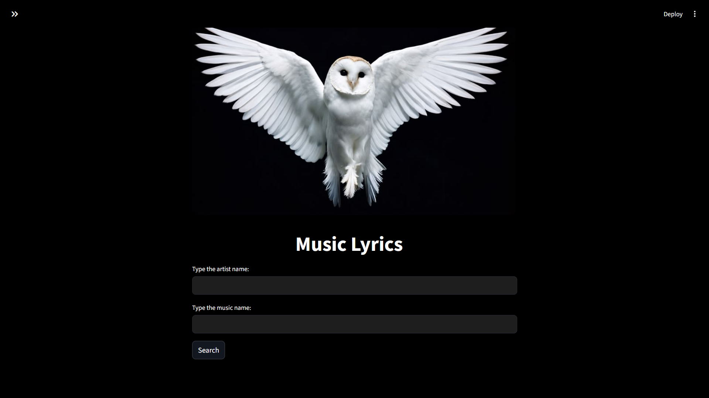
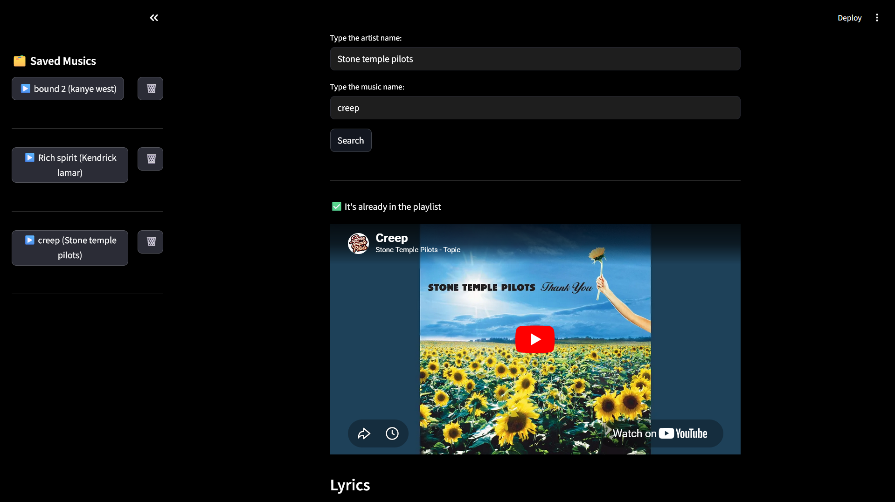

# 🎵 Music Lyrics App

Search for lyrics, watch YouTube videos, and manage your own playlist in one place.



## ✨ Features
*   **Search:** Find lyrics by artist and song name.
*   **Watch:** Integrated YouTube player.
*   **Save:** Add your favorite songs to a local playlist.


## 🚀 Quick Start

1.  **Clone the project:**
    ```bash
    git clone https://github.com/Luasqk/API-de-Musicas
    ```
2.  **Install requirements:**
    ```bash
    pip install streamlit requests youtube-search
    ```
3.  **Run the app:**
    ```bash
    streamlit run main.py
    ```
    
---

## 🛠️ Tech Stack
*   **Streamlit** (UI)
*   **Lyrics.ovh** (API)
*   **Youtube Search** (Library)